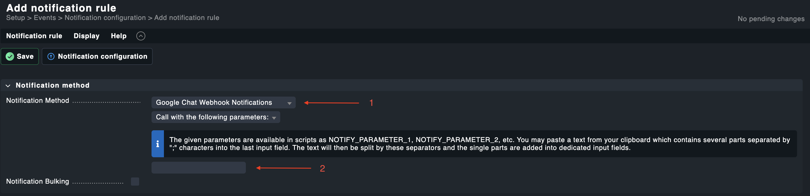

# Check_mk Google Chat Webhook plugin
Check_mk  plugin to allow check_mk to send notifications via Google Chat webhook.

This plugins requires the following python libraries:
* requests
* json

This plugin requires the Webhook url in order to function.

## Installation

* Install the python libraries
* Copy this script to your checmk_mk site:  `~/share/check_mk/notifications`
* Make the script executable

## Configuration
1. Create a new notifications rules with `Setup > Events> Notifications > Add rule`.
2. For the Notifications Method choose `Google Chat Webhook Notifications`.
3. Enter your Google Chat Webhook URL in the parameter field noted in step 2 of the screenshot below

